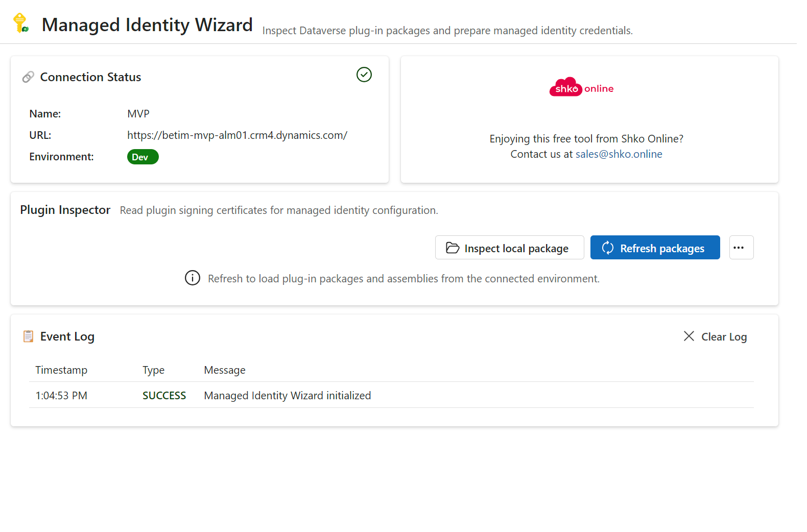
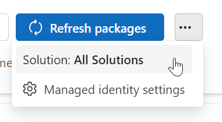
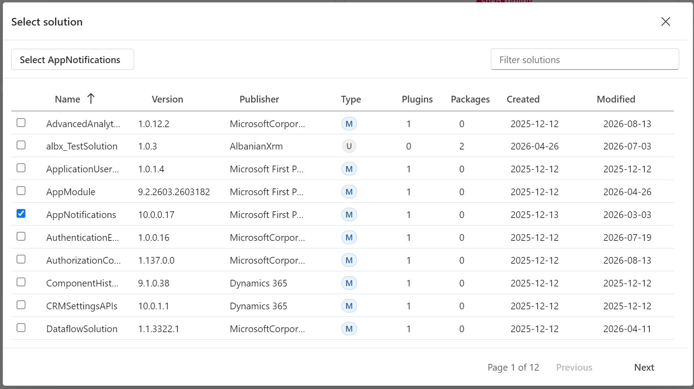
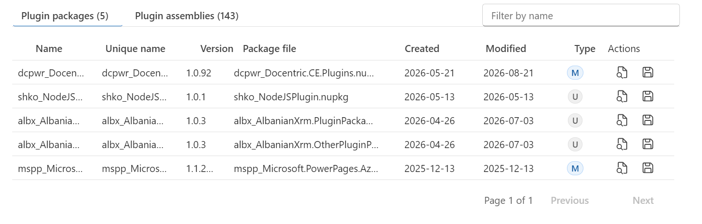
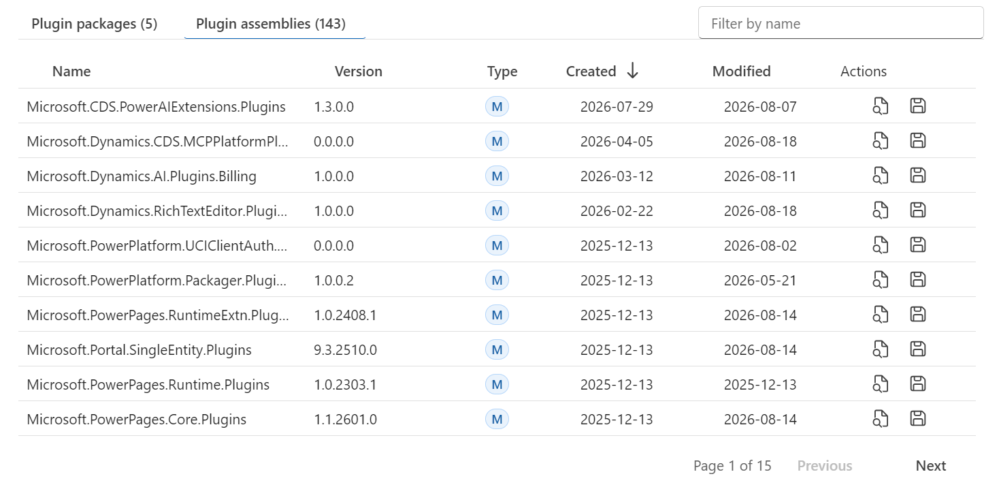
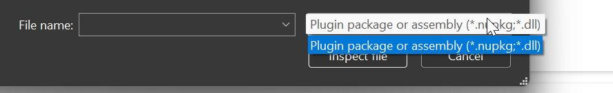
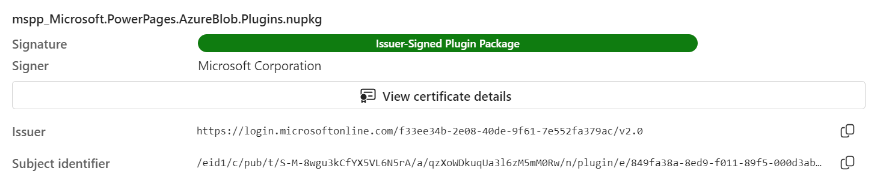
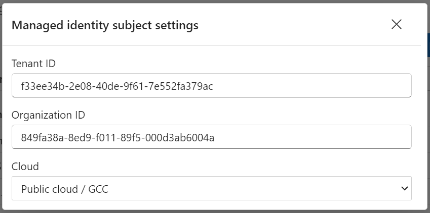
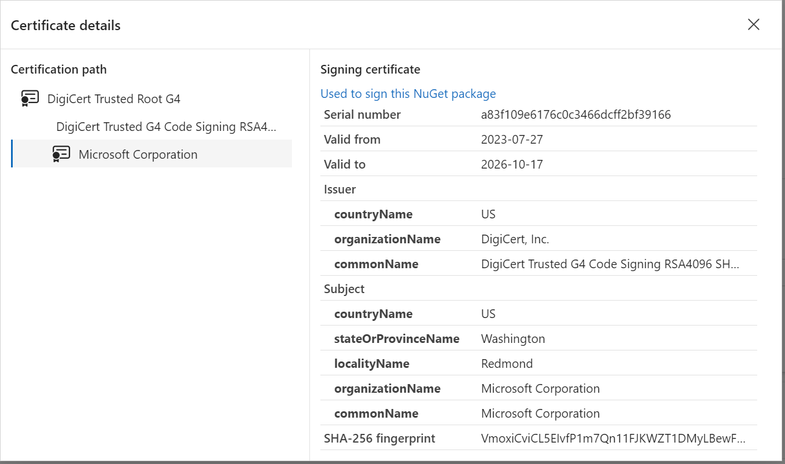

> # Copyright Notice
>
> Copyright 2026 Shko Online LLC <sales@shko.online>
> 
> Licensed under the Apache License, Version 2.0 (the "License");
> you may not use this file except in compliance with the License.
> You may obtain a copy of the License at
> 
>     http://www.apache.org/licenses/LICENSE-2.0
> 
> Unless required by applicable law or agreed to in writing, software
> distributed under the License is distributed on an "AS IS" BASIS,
> WITHOUT WARRANTIES OR CONDITIONS OF ANY KIND, either express or implied.
> See the License for the specific language governing permissions and
> limitations under the License.

# Managed Identity Wizard

A PPTB tool to simplify configuring Dataverse Managed Identity for Plugin Assemblies or Plugin Packages.

## Solution Filter
Hidden in the flyout menu you can find the Solution Filter.

Clicking that command will open the solution filter popup.

Once you have found the solution you want to filter with you can click the `Select {Solution Name}` button which will activate the solution filter.

## Plugin Packages and Assemblies
Clicking `Refresh Packages` shows the list of available Plugin Packages and Plugin Assemblies for the selected solution, or All Solutions.

For both we have two possible actions:
1. Inspect 
2. Export 

## Inspect local package
If we are developing the plugin and have the plugin `.nupkg` or `.dll` available locally, we can also inspect these artefacts to check the signature. Clicking `Inspect local package` will open a file selection dialog.

## Inspection
Selecting a package or plugin assembly will show the Inspection form.

This includes `Issuer` and `Subject Identifier` fields calculated from the plugin signature. Some details are controlled by *Managed identity subject settings*

if we are interested in the signature and the public certificate of the signer we can click `View certificate details`

## Managed Identity subject settings
We can open the `Managed identity settings` by clicking the command on the flyout actions.
 

it will open the popup with the following configurations:

## Certificate Details

Certificate details are show. Including the certification path.

## License

Apache-2.0
